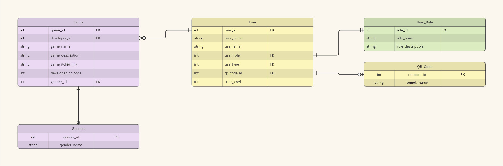

# Estrutura Relacional 

Uma estutura relacional de entidades é extremamente importante para o desenvolvimento de um sistema, uma vez que permite o entendimento claros das entidades e seus atributos.

**Imagem - 1** : Estrutura relacional de entidades

Fonte - Elaboração própria, Inteli Game Lab 

  

